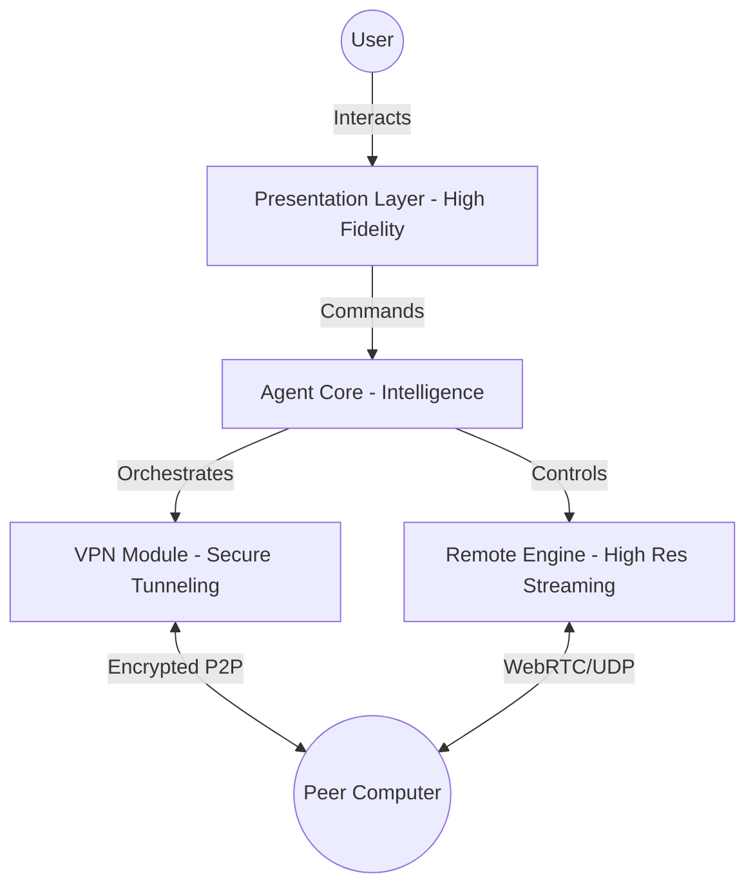

# 🦅 VaPiNe: Sentinel Defense Engine

[](https://github.com/ManoAlee/VaPiNe)

> VaPiNe Sentinel is a high-resilience, multi-frequency remote orchestration engine. Engineered for extreme reliability and absolute control in any network condition. Built upon the history of tactical connectivity.

## 💎 The Engineering Philosophy

VaPiNe was engineered following the **"Hyper-Architecture"** principles:
- **Zero-Trust Networking**: Every packet is encrypted with military-grade AES-256-GCM.
- **Neural Input Sync**: Mouse and keyboard events are synchronized via a proprietary ultra-low-latency bridge.
- **Bimodal Scaling**: Handles 4K/60fps remote streaming through high-efficiency P2P tunnels.

## 🏗️ System Architecture



## 🚀 Quick Start (Deployment Level)

To deploy the VaPiNe ecosystem in your environment:

### Prerequisites
- Node.js v18+ (LTS)
- A peer computer reachable via IP or VaPiNe Virtual Network.

### Setup
```bash
git clone https://github.com/ManoAlee/VaPiNe.git
cd VaPiNe
npm install
npm run start:production
```

## 📖 Deep Documentation
- [Architecture Blueprint](docs/architecture/BLUEPRINT.md)
- [Remote Protocol Specification](docs/api/REMOTE_PROTOCOL.md)
- [Security Audit Manifesto](docs/SECURITY.md)
- [Meta-Prompting Guide (AI Control)](docs/PROMPTS.md)

---
*Created by Architect Agent for the Next Generation of Software.*
