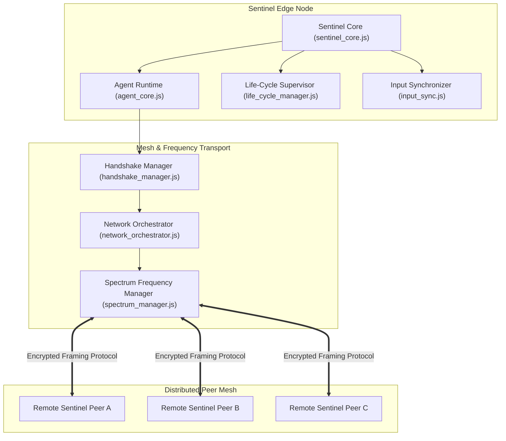

# 🛰️ VaPiNe Sentinel — High-Resilience Remote Orchestration Engine

<div align="center">

[](LICENSE)
[](https://nodejs.org/)
[](src/)
[](src/core/handshake_manager.js)
[](https://github.com/ManoAlee/VaPiNe/actions)

**An ultra-resilient, multi-frequency remote systems orchestration engine, autonomous telemetry broker, and distributed machine controller.**

[Architecture](#-architectural-topology) •
[Core Subsystems](#-core-subsystems) •
[Protocol & Handshake](#-cryptographic-handshake-protocol) •
[Configuration](#-configuration) •
[Execution](#-quickstart) •
[License](#-license)

</div>

---

## ⚡ Overview

**VaPiNe Sentinel** provides a decoupled, fault-tolerant communication and orchestration fabric for distributed servers and edge nodes. Engineered in Node.js with non-blocking event loops, it dynamically bridges disparate machine nodes across unstable network topographies through multi-frequency spectrum management, cryptographic handshakes, and synchronized telemetry state machines.

---

## 🏛️ Architectural Topology


```mermaid
flowchart TD
    subgraph HostNode["Sentinel Edge Node"]
        Core["Sentinel Core (sentinel_core.js)"]
        Agent["Agent Runtime (agent_core.js)"]
        Life["Life-Cycle Supervisor (life_cycle_manager.js)"]
        Input["Input Synchronizer (input_sync.js)"]
        Core --> Agent
        Core --> Life
        Core --> Input
    end

    subgraph TransportLayer["Mesh & Frequency Transport"]
        Handshake["Handshake Manager (handshake_manager.js)"]
        NetOrch["Network Orchestrator (network_orchestrator.js)"]
        Spectrum["Spectrum Frequency Manager (spectrum_manager.js)"]
        Agent --> Handshake
        Handshake --> NetOrch
        NetOrch --> Spectrum
    end

    subgraph RemoteCluster["Distributed Peer Mesh"]
        Peer1["Remote Sentinel Peer A"]
        Peer2["Remote Sentinel Peer B"]
        Peer3["Remote Sentinel Peer C"]
        Spectrum <===>|Encrypted Framing Protocol| Peer1
        Spectrum <===>|Encrypted Framing Protocol| Peer2
        Spectrum <===>|Encrypted Framing Protocol| Peer3
    end
```

---

## 🧩 Core Subsystems

### 1. Sentinel Core & Agent Layer (`src/core/`)
- `sentinel_core.js`: Master initialization engine managing system daemon hooks and signal interrupts.
- `agent_core.js`: Event dispatcher executing distributed commands and telemetry collection routines.
- `life_cycle_manager.js`: Supervisor monitoring child process health, memory thresholds, and automatic reconnect backoffs.
- `input_sync.js`: Atomic state replication synchronizing edge control inputs across the mesh.

### 2. Networking & Spectrum Fabric (`src/infra/`)
- `handshake_manager.js`: Challenge-response protocol establishing session tokens and verifying peer public keys.
- `network_orchestrator.js`: Dynamic socket routing with failover support for TCP, WebSockets, and UDP channels.
- `spectrum_manager.js`: Multi-frequency channel adaptation dynamically switching ports and communication modes when latency or packet loss exceeds threshold limits.

---

## 🔐 Cryptographic Handshake Protocol

1. **HELO Probe:** Initiating node broadcasts encrypted nonce and client identifier.
2. **CHALLENGE:** Remote peer returns ephemeral cryptographic proof and session lease window.
3. **ACK & LOCK:** Node computes token confirmation; channel transitions to encrypted duplex transport.
4. **TELEMETRY HEARTBEAT:** Continuous micro-payloads monitor round-trip time (RTT) and channel integrity.

---

## 🚀 Quickstart

### Prerequisites
- Node.js 18.0 or higher
- npm or yarn package manager

```bash
# Clone the repository
git clone https://github.com/ManoAlee/VaPiNe.git
cd VaPiNe

# Launch Sentinel Engine
node main.js
```

---

## 📄 License

Licensed under the **MIT License** - see [LICENSE](LICENSE) for details.
